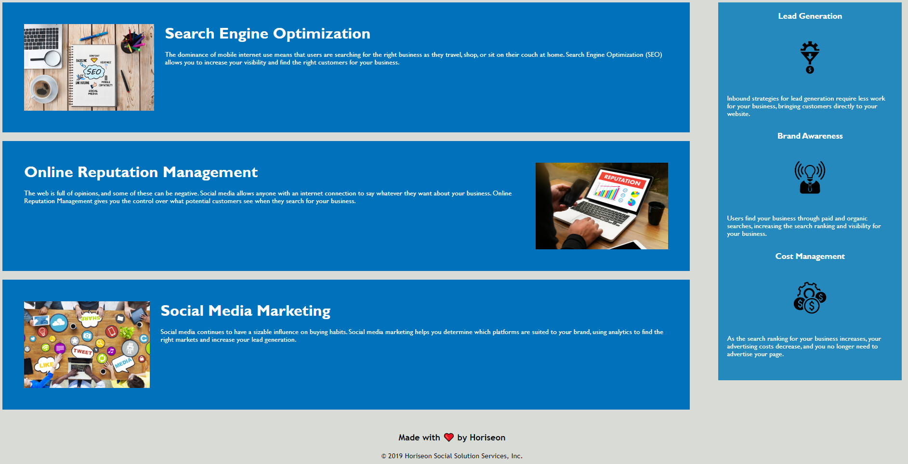

# Refactor-Challenge

## Description

Refactor code challenge for Horiseon services website. Several changes were made to the website including but not limited to, condensing the HTML and CSS code into more semantic structure, and replacing code with semantic elements when necessary. Comments were also added to the CSS file for ease of reading for any future developers that may work on the project. 

## Link To Site
https://brughk.github.io/refactor-challenge/

   

 